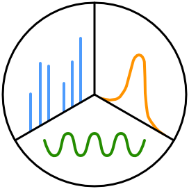

# PARADIAS: Parallel factor analysis of Data-Independent-Acquired Spectra



PARADIAS is a GPU-powered unsupervised multiway factor analysis framework that deconvolves multispectral scans to individual analyte spectra, chromatographic profiles, and sample abundances, using the PARAFAC tensor decomposition method. The deconvolved spectra can be annotated with traditional database search engines or used as a high-quality input for *de novo* sequencing methods.

*Parallel factor analysis enables quantification and identification of highly-convolved data independent-acquired protein spectra*, Filip Buric, Jan Zrimec, Aleksej Zelezniak, bioRxiv 2020.04.21.052654; doi: https://doi.org/10.1101/2020.04.21.052654

## Note

This repository holds the PARADIAS scripts that produced the results in the bioRxiv preprint. Restructuring the pipeline and making it easy to use is a work in progress. The repository will be updated but this revision is kept to freeze the source code to the time of manuscript submission.

## Dependencies

We recommend using a conda environment to set up all dependencies.
One can be built from scratch using the provided `paradias_env.yaml` specification file
or a Docker image with all dependencies can be used from <TODO>. 
Alternatively, a Docker image may be built using the provided `Dockerfile`.

Here, commands will be shown with the Docker alternative since it has the extra step of running a container.

## Usage

The pipeline currently consists of a collection of scripts.
Step-by-step instruction are listed here using the toy data files provided in this repo. 
These are primarily meant to test the pipeline is working properly.

Expected running times are given as a very rough estimate on 9 real DIA scan files,
to indicate the time scale of the steps.
These times will of course vary depending on the available resources.
Actual running times for the test experiment should be exceedingly short.

We recommend running the pipeline on a workstation with multiple cores or 
a high-performance computing (HPC) environment. Currently, the HPC manager `slurm` is provided.

An NVIDIA GPU card is required for the decomposition.
Partial support for CPU-only execution is implemented but the performance becomes infeasible.

### 0. Configure PARADIAS execution

The execution of the pipeline is configured through a YAML file
(`test_experiment/config/paradias.yaml`). 
This configuration file specifies the location of input and intermediate files,
as well as algorithm parameters. The paths are interpreted as relative to the 
experiment directory `root_dir`.

Please read through the next steps to see which parameters are relevant at each step.
A full configuration file is provided in the test experiment.

### 1. Convert DIA scan files from mzML to CSV

> Expected running time: 3-5 minutes per file

The basename of the input mzML files will be kept downstream, with only the extension changed.

Relevant pipeline config values:

* `samples_mzml` - location of input mzML files
* `samples_csv` - location of output CSV files
* `swath_windows` - file listing precursor isolation windows 
* `min_scan_intensity` - all values below this are dropped

Note: To set Snakemake to use `N` cores, pass it the `--jobs N` argument.
It should automatically use all available cores. 

Commands:

```bash
configfile='test/test_experiment/config/paradias.yaml'

docker run --mount type=bind,source="$(pwd)"/test/test_experiment,target=/app/test/test_experiment paradias:test \
    snakemake -s scripts/util/mzml2csv.Snakefile --configfile ${configfile}
```

### 2. Adjust precursor isolation windows

We cannot have overlapping isolation windows, so the bounds are adjusted.

> Expected running time: 2 min per file

Relevant pipeline config values:

* `samples_csv` - location of CSV scan files
* `samples_adjusted_swaths` - location of output adjusted CSV files
* `swath_windows_adjusted` - file listing adjusted precursor isolation windows

Command:

```bash
docker run --mount type=bind,source="$(pwd)"/test/test_experiment,target=/app/test/test_experiment paradias:test \
    snakemake --forceall -s scripts/util/adjust_swaths.Snakefile --configfile  ${configfile}
```

### 3. Split samples into slices

The input scans are partitioned into swaths and RT windows of width `window_size_sec`.
Note that this will create many small CSV files in `slices_location/swath=value/rt_window=value` subdirectories. 

> Expected running time: 30 min

Relevant pipeline config values:

* `samples_adjusted_swaths` - location of output adjusted CSV files
* `window_size_sec` - the width of the RT windows
* `slices_location` - location of output slices

```bash
docker run --mount type=bind,source="$(pwd)"/test/test_experiment,target=/app/test/test_experiment paradias:test \
    python scripts/util/split_csv_maps_to_slices.py --config ${configfile}
```

## 4. Generate tensor files for all slices

The slices are converted into NumPy (swath, rt, sample) tensors stored as `.npy` files. 
The Snakefile will start the conversions for each slice in parallel and each such job may
be submitted independently as a HPC cluster job.

> Expected running time: 10 - 40 min (depending on available resources)

Relevant pipeline config values:

* `mass_tol_ppm` - The mass tolerance (in PPM) of the scan acquisition

The m/z precision is 10 decimals and 
m/z partitions with less than 5 time points in any sample are filtered out.

```bash
docker run --mount type=bind,source="$(pwd)"/test/test_experiment,target=/app/test/test_experiment paradias:test \
    snakemake --jobs 4 -s scripts/util/generate_slice_tensors.Snakefile \
    -R generate_slice_tensor --forceall --rerun-incomplete --configfile ${configfile} 
```

On a slurm-managed cluster, this would be:

```bash
snakemake --jobs 200 -s scripts/util/generate_slice_tensors.Snakefile \
  -R generate_slice_tensor --forceall --rerun-incomplete --configfile ${configfile} \
  --cluster "sbatch -A {account.number} -t 06:00:00 --ntasks 6"
```

## 5. Run PARAFAC decomposition

TODO: expand, clarify

> Expected running time: 6 - 12 hours (depending on the GPU model)

```bash
sbatch --array=0-1 --gres=gpu:1 --time 48:00:00 \
    parafac/decompose_cluster_singularity.sh ${snake_configfile}
```

## 6. Index all PARAFAC models and components

This is a necessary step for downstream analysis. It assigns a unique ID to each
PARAFAC model and components.

TODO: expand, clarify

```bash
sbatch --time 00:20:00 --ntasks 1 --cpus-per-task 30 \
    run_python.sh parafac/models.py -c ${configfile}
```

## 7. Select Best Models

TODO: expand, clarify

First, collect the time modes and measure unimodality fractions.

```bash
sbatch --ntasks 1 --cpus-per-task 32 \
    run_python.sh parafac/collect_time_mode_values.py -c ${configfile}
```

Then, select models:

```bash
sbatch parafac/select_best_models.sh -c ${configfile}
```

## 8. Identify proteins using Crux or MS-GF+

Configure which tool to use through the configuration file

TODO: expand, clarify

```bash
sbatch -t 04:00:00 \
    run_python.sh parafac/id_models_concat.py -c ${configfile}
```

## 9. Build library

TODO: expand, clarify

```bash
snakemake -s quantification/build_library.Snakefile --configfile ${configfile}
```

## 10. Quantify proteins with DIA-NN

TODO: expand, clarify

```bash
sbatch quantification/diann_slurm.sh --configfile ${configfile}
```

## 11. De novo sequencing with Novor and DeepNovo

Configure which tool to use through the configuration file

TODO: expand, clarify

```bash
snakemake -s denovo/sequence_best_models.Snakefile --configfile ${configfile}
```
